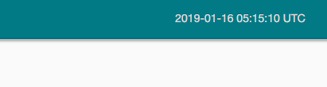

# Apache airflow timezone 설정

airflow는 기본적으로 모든 시간대를 **UTC** 기준으로 처리한다(**"Asia/Seoul"** 과는 9시간 차이)  
그래서 batch 작업 스케쥴을 설정할때 9시간 차이를 생각해야하고, UI에 표현되는 실행관련 시간들도 9시간 차이를 계산해야한다.

airflow 1.10 버전부터 airflow 설정파일에(**airflow.cfg**) timezone을 설정할수 있게 되었으나 UI에 나오는 시간들은 여전히 UTC 기준이라 혼동은 계속되었다.

Opensource의 코드를 수정하는걸 매우 싫어 하지만 직관적인 모니터링을 위해 airflow의 코드를 몇군데 수정하여 **KST** 기준으로 볼수있는 방법을 알아보자.

## airflow.cfg 설정
**airflow.cfg** 파일은 airflow의 설정파일 이다.   <code>$AIRFLOW_HOME/airflow.cfg에 위치</code>  

44 line 쯤에 보면 아래와 같은 항목이 있는데, **default_timezone**을 변경하면 된다.  
```
# Default timezone in case supplied date times are naive
# can be utc (default), system, or any IANA timezone string (e.g. Europe/Amsterdam)
#default_timezone = utc        << default
default_timezone = Asia/Seoul  << Asia/Seoul 로 변경
```

위와 같이 설정하면 **dag**의 <code>scheduled_interval="10 10 * * *"</code> 에 입력한 crontrigger 설정 그대로 실행된다.  즉 AM 10:10에 dag가 실행된다. 

만약 <code>default_timezone = utc</code> 상태이면 위의 설정은 PM 07:10에 dag가 실행된다.

## UI - menubar의 clock  
airflow UI의 메뉴바 에는 현재시간이 초단위로 표시되는데 UTC 기준으로 나온다.
<p align="center">
  
</p>

### admin.html 파일 수정
airflow는 대부분 pip로 설치하게 되므로 pip가 설치된 path와 같은경로에 설치된다.
(airflow의 설정파일, db, log 가 존재하는 경로가 아닌 실제 코드가 있는 경로를 의미함)

```
[oksusu@oksusu01 airflow]$ pip -V
pip 18.1 from /home/oksusu/tools/intelpython3/intelpython3/lib/python3.6/site-packages/pip (python 3.6)
```

만약 airflow 설치시 pip 옵션으로 <code>--user</code>를 주었다면 아래 경로에 설치된다.
```
$HOME/.local/lib/python{version}/site-packages/ 
```

본인의 경우 <code>--user</code> 옵션을 주어서 설치했기 때문에 아래와 같은 경로에 airflow 코드가 존재한다.

```
[oksusu@oksusu01 airflow]$ pwd
/home/oksusu/.local/lib/python3.6/site-packages/airflow
[oksusu@oksusu01 airflow]$ ls -al
합계 400
drwxrwxr-x 22 oksusu oksusu   4096  1월  8 17:16 .
drwx------ 49 oksusu oksusu   4096  1월  9 14:40 ..
-rw-rw-r--  1 oksusu oksusu   3035  1월  8 17:16 __init__.py
drwxrwxr-x  2 oksusu oksusu    334  1월  8 17:16 __pycache__
-rw-rw-r--  1 oksusu oksusu   2239  1월  8 17:16 alembic.ini
drwxrwxr-x  6 oksusu oksusu     84  1월  8 17:16 api
drwxrwxr-x  3 oksusu oksusu     73  1월  8 17:16 bin
drwxrwxr-x  3 oksusu oksusu    188  1월  8 17:16 config_templates
-rw-rw-r--  1 oksusu oksusu  19721  1월  8 17:16 configuration.py
drwxrwxr-x 11 oksusu oksusu    168  1월  8 17:16 contrib
drwxrwxr-x  3 oksusu oksusu     63  1월 10 13:06 dag
-rw-rw-r--  1 oksusu oksusu   2660  1월  8 17:16 default_login.py
drwxrwxr-x  4 oksusu oksusu   4096  1월  8 17:16 example_dags
-rw-rw-r--  1 oksusu oksusu   2616  1월  8 17:16 exceptions.py
drwxrwxr-x  3 oksusu oksusu    173  1월  8 17:16 executors
drwxrwxr-x  3 oksusu oksusu   4096  1월  8 17:16 hooks
-rw-rw-r--  1 oksusu oksusu 112533  1월  8 17:16 jobs.py
drwxrwxr-x  4 oksusu oksusu     78  1월  8 17:16 lineage
-rw-rw-r--  1 oksusu oksusu   3945  1월  8 17:16 logging_config.py
drwxrwxr-x  3 oksusu oksusu     59  1월  8 17:16 macros
drwxrwxr-x  4 oksusu oksusu     74  1월  8 17:16 migrations
-rw-rw-r--  1 oksusu oksusu 198116  1월  8 17:16 models.py
drwxrwxr-x  3 oksusu oksusu   4096  1월  8 17:16 operators
-rw-rw-r--  1 oksusu oksusu   4417  1월  8 17:16 plugins_manager.py
drwxrwxr-x  3 oksusu oksusu     79  1월  8 17:16 security
drwxrwxr-x  3 oksusu oksusu   4096  1월  8 17:16 sensors
-rw-rw-r--  1 oksusu oksusu   8550  1월  8 17:16 settings.py
drwxrwxr-x  4 oksusu oksusu     63  1월  8 17:16 task
drwxrwxr-x  4 oksusu oksusu     78  1월  8 17:16 ti_deps
drwxrwxr-x  4 oksusu oksusu   4096  1월 15 17:26 utils
-rw-rw-r--  1 oksusu oksusu    833  1월  8 17:16 version.py
drwxrwxr-x  6 oksusu oksusu    216  1월  8 17:16 www
drwxrwxr-x  6 oksusu oksusu    248  1월  8 17:16 www_rbac
```

위 경로아래 <code>./www/templates/admin</code> 에 보면 **master.html** 파일이 존재하며, 이 파일에서 javascript 부분을 수정한다.

```
x = new Date()
//var UTCseconds = (x.getTime() + x.getTimezoneOffset()*60*1000);
var UTCseconds = (x.getTime());  << 현재시간만 반영
  $("#clock").clock({
    "dateFormat":"Y-m-d ",
    //"timeFormat":"H:i:s %UTC%",
    "timeFormat":"H:i:s %KST%",   << UTC라는 문자열을 KST로 변경
    "timestamp":UTCseconds
  }).click(function(){
     alert('{{ hostname }}');
  });
```

위의 코드를 수정 후 airflow UI를 refresh 하면 아래와 같이 KST 기준의 시간을 볼 수 있다.
<p align="center">
  
</p>

## UI - tree 영역의 time

